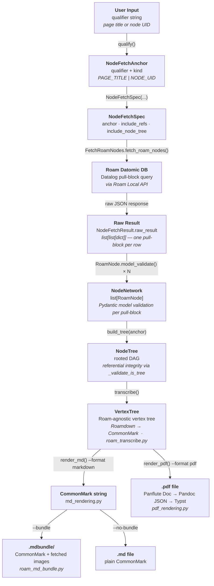

# Basic processing pipeline

A high-level overview of the core data processing pipeline that is utilized by the scripts in this project.

1. `FetchSpec`: user supplies a qualifier (`NodeFetchAnchor`) that identifies the anchor (starting) node in the Roam Datomic query, as well as some join semantics (`include_refs`)
2. *"Raw" result*: `FetchSpec` is used to query the Roam Datomic DB., which results in a list of Datomic pull-blocks (`NodeFetchResult.raw_result`)
3. `NodeNetwork`: Each raw result pull-block is parsed into a `RoamNode`, validating it using the Pydantic model specified on `RoamNode`
4. `NodeTree`: build a `NodeTree` (DAG) from `NodeNetwork`, using the `RoamNode` identified in `NodeFetchAnchor` as the root of the tree. Apply all referential integrity constraints specified in the Pydantic `@model_validator` `_validate_is_tree`.
5. `VertexTree`: "transcribe" the `NodeTree` into a Roam agnostic `VertexTree`, via `roam_transcribe.py::transcribe`. During transcription, Roam flavored Markdown (Roamdown) is translated into CommonMark.
6. **Output** (two mutually exclusive paths, controlled by `--format`):
   - **Markdown** (`md_rendering.py`): render the `VertexTree` to a CommonMark string, then either write a plain `.md` file (`--no-bundle`) or fetch Cloud Firestore image assets and write a self-contained `.mdbundle/` directory (`--bundle`).
   - **PDF** (`pdf_rendering.py`): fetch Cloud Firestore image assets via `FetchRoamAsset`, build a Panflute `Doc` (Pandoc object model) directly from the `VertexTree`, serialize to Pandoc JSON, and invoke Pandoc + Typst to produce a `.pdf` file.

## Diagram

